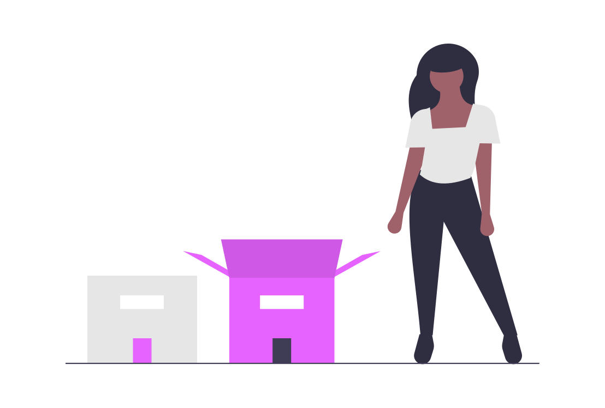

# desafio1semana

# #Biblioteca e Framework 
### (Conceitos e diferenças)

Quando se fala em usar *tecnologia da informação* é importante conhecer bem  os recursos disponíveis para aperfeiçoar o seu trabalho e entender os conceitos envolvidos na área de *desenvolvimento*. Pensando nisso, hoje vamos apresentar os conceitos e as diferenças entre **bibliotecas** e **frameworks** envolvidos.

# **Bibliotecas**

Em *programação*, desenvolvedores disponibilizam bibliotecas que possuem muitas funções prontas. Assim, outros programadores podem utilizá-las, permitindo que o desenvolvimento seja mais simples e rápido.

Um conjunto de *subprogramas ou funções*, geralmente organizadas em classes, que podem ser usadas para a construção de um *software ou aplicativo mobile*. 

As bibliotecas geralmente tornam a utilização de uma linguagem de programação mais fácil para nos ajudar no  desenvolvimento de uma aplicação de sucesso. É o recurso mais utilizado no mundo da *programação*.
***A ideia da biblioteca é compartilhar soluções por meio de funções ou métodos.***

O mercado web nos oferece diversas soluções para desenvolver um software de qualidade e dentro das normas. 

As *bibliotecas* usam seu código como base a uma implementação de regras, um conjunto de funções que visa facilitar a utilização de uma determinada linguagem.
Exemplo:
>Fazer um ***Convert.ToInt32*** em ***C#***, está utilizando um método da ****classe Convert***, que está na biblioteca ***System***. 
Ou quando for fazer um ***toUpper*** em ***Java***, você está usando a biblioteca ***java.Lang***. 

Todas essas *bibliotecas* são externas ao seu projeto, porém, nativas da sua respectiva linguagem. Se for necessário, você também pode importar bibliotecas que não são nativas.

***Além disso, também é possível criar bibliotecas internas no seu projeto.***

Para darmos um exemplo ainda mais popular, podemos citar o ***jQuery***, talvez a *biblioteca* mais conhecida no universo da TI, principalmente, se você trabalha com ***desenvolvimento front-end***.

